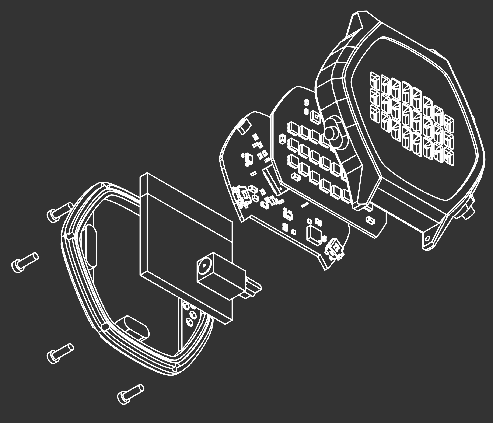

About
-----

This is the very-much-in-progress firmware for the [M-Watch](https://jonathan.rico.live/projects/m-watch/), specifically, the nRF52840 version.
It uses zephyr / Nordic Connect SDK as base.

Code is not production quality obv, since this is my free time :p

Hardware
--------

Visit the [project page](https://jonathan.rico.live/projects/m-watch/) for an in-depth rundown of the hardware.

- nRF52840 bluetooth SoC
- LIS3DH ultra low power accelerometer
- 24 rgb leds: APA102, small variant
- 3 pushbuttons for user interaction
- vibration motor + driver
- powered from 150mAh lipo battery + TI low-Iq DCDC
- Custom watch case, compatible with standard quick-release straps, see-through/translucent led display
- Pogo-pin charging + SWD debugging on the back

Features
--------

- Time display in BCD and digital formats
- Date display
- Shake wrist to wake display up
- Set the time using the accelerometer (fun!)
- Basic stopwatch
- Basic countdown timer
- Bluetooth Current Time Service implementation
- NCS FOTA (bluetooth fw upgrade)
